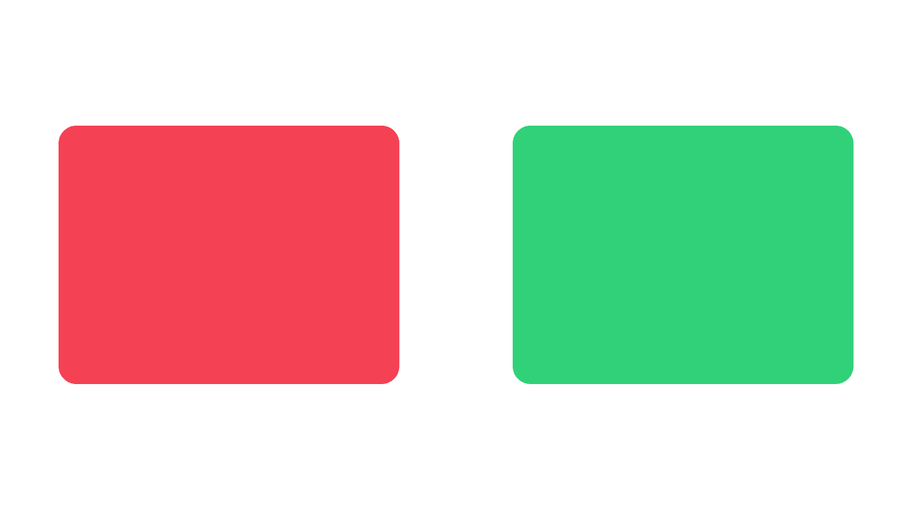
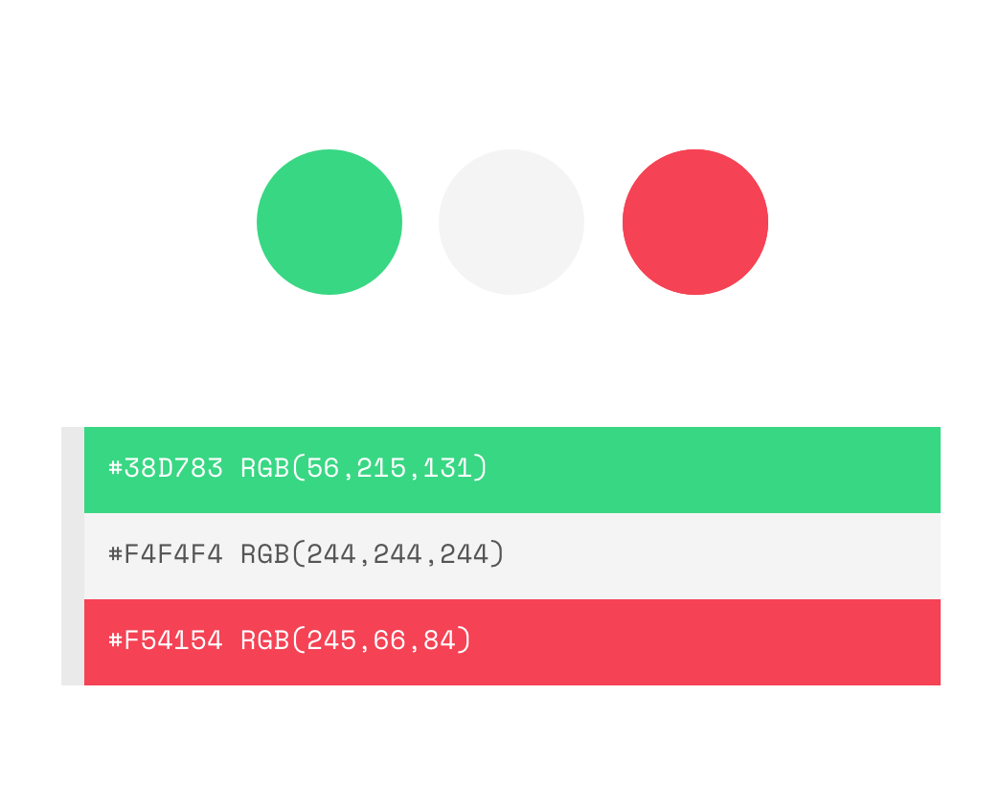
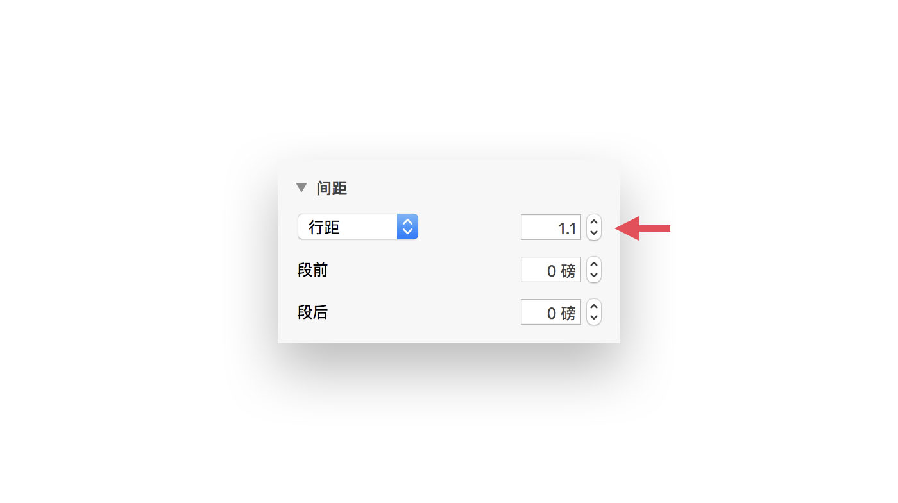
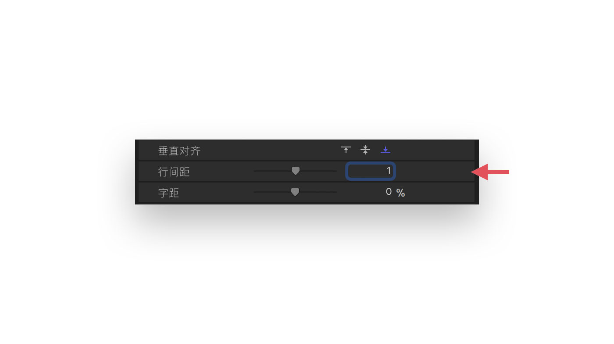
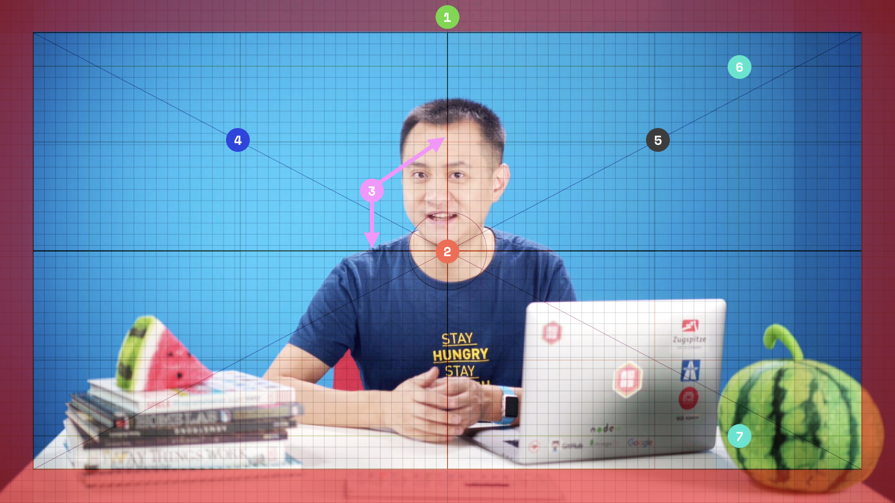
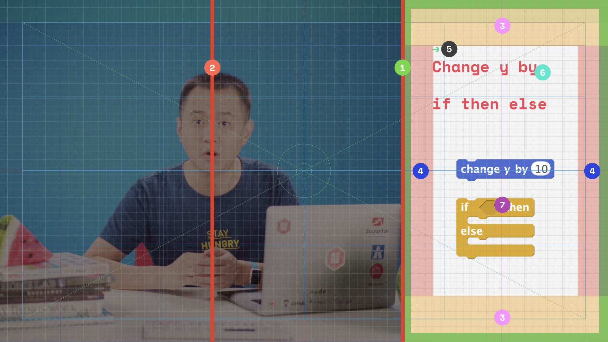

# 设计 Design


## 动效
> 给用户提供符合时宜的正确信息，是动效应该达到的效果。

动效并*不只是为了增强画面的观感和趣味性*，它应该起到向导的作用。在此基础上，引导用户有效地理解正确的信息。

优秀的动效需要满足几个原则：
* *符合自然物理运动规则*（可使动效更加生动）
* *快速有效*（不要过慢）
* *无闪烁感*（除非是特别需要，否则过快变化的动效容易引起观看者生理不适感）
* *节奏一致*（系列动效的节奏应该是一致的）
* *预备与缓冲*（动效的运动可被预期，并符合观看者心理预期）

在 MVL 中，制定了一套动效标准。请务必按照此标准制作相关动效：

!> 红色为错误示例，绿色为正确示例

#### 1.符合自然物理运动规律

<center>符合自然物理运动规律示意图</center>

> 虚拟宇宙同样遵循真实世界中的物理法则，高度还原其物理精度和刻画材质的细节来营造一种真实感

这是科幻电影导演说过的话。动效设计上遵循物体世界的法则。当你开始把引力和惯性，速度和刚度考虑在内，动效就会看起来非常逼真，和物理世界的高度相似性给人以熟悉感，并且变得可预期，有利于促进用户快速聚焦到含有动效的内容或部件上。

#### 2.快速有效

<center>快速有效示意图</center>

> 激活神经的动觉，有助于加速思考

动效应匹配影像节奏，快速果断，不拖沓。快速的动效有机率激活人的动觉感知，从而提升肌肉和神经的运作效率，加快思维节奏。

#### 3.无闪烁感


<center>无闪烁感示意图</center>

> 有时候我们会感到画面不停地闪烁,甚至使眼睛非常不适,这说明画面的呈现速度低于临界闪光频率。

与短片性质的影像不同，MVL 的课程影像通常超过10分钟的观看时间，在此期间，营造舒适的观影体验是十分必要的。所以，如果没有特殊要求，画面应该不要产生高频率，频率均速或不均速的运动。

#### 4.节奏一致


<center>节奏一致示意图</center>

> 有节奏的运动能带来工整专业的感觉，营造稳定祥和的氛围。

动效跟随背景音乐的节奏和老师说话的节奏，可以让学生的注意力更加集中，没有节奏的动效就像音乐中不协和声调。往往会打乱观看者的心流，造成精神和注意力不集中和涣散。

#### 5.预备与缓冲


<center>预备与缓冲示意图</center>

> 传达给用户可能将要发生或期待的交互是什么，有效引导用户理解课程内容或信息。

就像一个个小提示，预备和缓冲帮助用户了解为将要发生的交互做好准备，比如「注意，看这儿！」。这些小细节不引人注目且经常被人忽略，但是如果用好，往往能带来意想不到的效果。


!> 不要使用运动模糊，在常规情况下，运动模糊并不直接被我们所认识。也就是说，我们观看到物体在运动时，并不把物体运动超出视觉频率产生模糊当作物体运动要素。为了让动效更加清晰明确。所有动效均不使用运动模糊效果。
## 颜色


<center> 西瓜三原色示意图</center>

西瓜三原色频繁出现在 MVL 各类元素中，作为品牌专色，不断引导和加深观看者对于西瓜品牌的认知和记忆。下载西瓜三原色 Sketch 模板：

<a class="b" href="http://oawmvi9ap.bkt.clouddn.com/MVL%20%E4%B8%89%E5%8E%9F%E8%89%B2.sketch.zip">下载西瓜三原色 Sketch 模板</a>

## 排版

在影像设计中，我们使用两种专用字族（字体家族）：中文使用方正粗俊黑简体，英文使用 Space Mono。如没有特殊需要请务必使用规定字族。

中文字体选择方正粗俊黑简体，这套字体形体细长，字面率节约空间。笔划设计独特，很容易建立一个「独立品牌识别特征」。

<a class="b" href="http://oawmvi9ap.bkt.clouddn.com/font-junhei.rar">下载中文字体</a>

英文字体选择 Space Mono，这套字体属于 Monospaced 字体，指字符宽度相同的电脑字体。通常在开发环境下，工程师都经常使用等宽字体，使用这类字体，可建立与行业相通的「独立品牌识别特征」。

<a class="b" href="http://oawmvi9ap.bkt.clouddn.com/font-spacemono.zip">下载 Space Mono</a>

#### 行高

在 MVL 中，规定了一个行高范围。在进行元素排版时，请按需使用这几类行高（为方便使用，Keynote 可直接在格式 - 文本 - 间距中进行调整）


<center>Keynote 使用方法示意图</center>

```
Keynote 中，行距使用 1.1
```


<center>Final Cut Pro 使用方法示意图</center>

```
Final Cut Pro 中，行距使用 1
```

#### 字号
!> 影像在不同尺寸，不同显示质量的屏幕中均会有效果的差别。所以一定要严格使用规定的字号范围。

```
字号指定从 42 磅到 90 磅
```


## 网格

> 目的：使用网格以简化排版，找到页面元素排布规律，减低时间和精力成本。
> 针对元素定位，排版时使用。

通常在进行元素排版时，我们很难找到合适标准去定位，使用剪辑工具中自带的网格又难以真正匹配到各个元素。因此，寻找一个简单又高效的办法极其重要。在 MVL 中我们使用专用网格。

每一个网格大小为（24像素长，24像素高）。在标准尺寸上（1080p），横排分布了 80个网格，竖排分布了45个网格。
#### 如何使用？
在定位排版时，选择专用网格模板，覆盖到内容之上并锁定使用。

#### 通用网格
通用网格一般可以用在安排新元素时。如果专用网格无法满足定位需要，请使用通用网格。


<center>通用网格示意图</center>

1. *非安全区*，这个区域宽度，高度均为3个网格（72像素），<em class="s">此区域不要放置任何信息内容。（某些含有出血的元素可以在此区域显示，但这类元素的信息和内容通常也不能超过此区域）</em>

2. *画面中心*，此为整个画面内容的中心，通常这个点正好对准 Shawn 的喉结。

3. *画面中心线*，视觉中心延展出来的水平和垂直的两条线，*注：这两条线没有对准到网格上，如果没有特殊需要，尽量不要把文字的基线对齐在画面中心线上。*

4. *左侧内容区*，此区域和 (5.) 一样，都属于添加各类叠层类元素的*最优位置*。我们应尽量将叠层类元素放到这两个区域内。

5. *右侧内容区*，此区域和 (4.) 一样，都属于添加各类叠层类元素的*最优位置*。我们应尽量将叠层类元素放到这两个区域内。

6. *上部定位优选线*，此线和 (7.) 一样，因为少儿的视域比较狭窄。为了提升信息到达率，应尽量把元素的可用信息内容放置到这个区域下方的位置。

7. *下部定位优选线*，此线和 (6.) 一样，因为少儿的视域比较狭窄。为了提升信息到达率，应尽量把元素的可用信息内容放置到这个区域上方的位置。

<a class="b" href="http://oawmvi9ap.bkt.clouddn.com/%E9%80%9A%E7%94%A8%E7%BD%91%E6%A0%BC.png.zip">下载通用网格</a>

#### 分屏网格

MVL 的设计元素中，有一种非常重要的元素——分屏，分屏网格是专门准备给分屏元素使用的一种专用网格。

> 分屏内容信息要聚焦，简洁，不要囤积信息，一定要表现得明确，简单。


<center>分屏网格示意图</center>

> 参考 [分屏](./elements?id=分屏)

1. *分屏分界线*，分屏约占全部画面的三分之一，分屏内容务必不能超出这条线。

2. *角色定位线*，当分屏出现在画面中时，整体场景也应该向左移动。此时主要人物的鼻部应该对准这条线。（这条线并没有在可用画面中心，是因为考虑观看者的有限视域。将原主体尽量靠近视觉中心，且尽量让可视区域居中对称）

3. *分屏内容上下出血*，此区域的上下高度都为 6个网格。为了保证信息的有效性，内容应持续地保留在特定区域，因此，所有分屏信息内容均不要超出此区域。

4. *分屏内容左右出血*，此区域的左右宽度都为 4个网格。为了保证信息的有效性，内容应持续地保留在特定区域，因此，所有分屏信息内容均不要超出此区域。

5. *分屏内容区标示符*，分屏内容首部需要添加此标示符。

6. *分屏内容正文区*，分屏的正文内容可安排在此区域内。

7. *分屏内容附属区*，通常这个位置可以放置图片与示意图。用来加强正文内容的精确性。

<a class="b" href="http://oawmvi9ap.bkt.clouddn.com/%E5%88%86%E5%B1%8F%E7%BD%91%E6%A0%BC.png.zip">下载分屏网格</a>

## 音乐与音效

?> 使用目的：提升画面视听体验，建立立体情境，辅助学生进入心流，增强趣味性。

* 背景音乐中不能使用和音效相同的元素
* 使用背景音乐时务必不要使音量过大。
* 元素切入和切出时音效务必对齐其画面动画内容。
* 与讲义说话速度同步。

> 阿洛里等人有关音乐家和非音乐人士的脑成像术实验表明,音乐能够激活大脑的大范围神经网络，伤感的音乐能够更明显地提升对照组与实验组的情感效价、能量标度和精神唤起度。小调、节奏缓慢、音强较弱、低速深沉、不协和音程与不稳定的和弦等音乐体式,也能诱发被试的负面情绪及相关经验。

所以，音乐与音效应避免：
* 使用小调
* 节奏过于缓慢
* 使用不协和的音程
* 使用不稳定的和弦
* 使用低沉低速的音色

*使用协和，且能被学生预知且能够表现品牌亲切感的音乐和音效。*

#### 节奏
音乐与音效制作时，需要参照影片中 Shawn 的语速。

?> 一般情况下，音乐与音效的节奏为：*130 bpm*

---
<p class="copyright">©2017 XiguaCity Inc.</p>
<p class="copyright">Melon Video Language (MVL) was Created by INVO</p>
