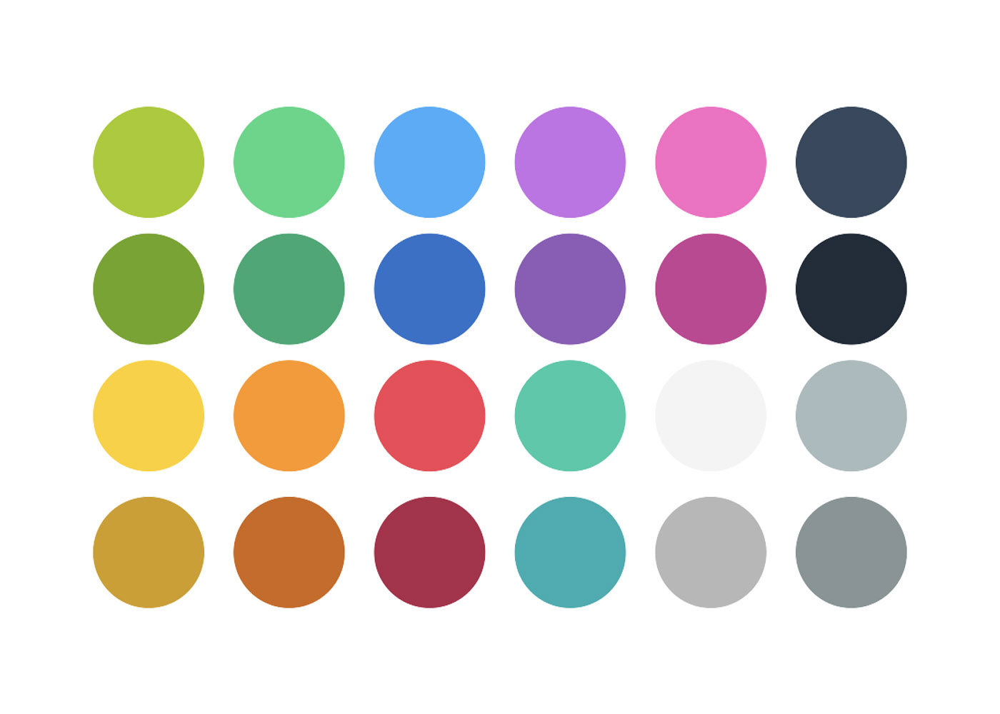

# 元素 Elements

MVL 中包含了各种元素，每种元素都以各自的使用目的，定义，方法和属性。参考元素相关说明。正确地使用元素，让影像传达*一致，友好*。增强用户群的品牌感受。

!> 下文中出现的颜色描述如西瓜红，西瓜绿，西瓜白都属品牌专用颜色，具体请参考 [颜色](./design?id=颜色)

!> 所有元素中的英文文本均为 Space Mono，中文均为方正粗俊黑简体，字体与行高具体请参考 [排版](./design?id=排版)

# 正文

?> 使用目的：利用生动的讲义强化老师的专业感，增强西瓜的品牌感受。

正文

课程讲义的重要组成。

!> 在录制正文内容时，需要老师尽量保持挺立的身姿。

更新布景和道具时，需要遵守：
* 出现品牌相关的道具。
* 背景墙不要有装饰物（须保持叠层出现区域的干净整洁）。
* 尽量不要遮盖老师的肢体。

布置灯光和拍摄时，务必：
* 保持灯光明亮（但不要过曝）。
* 布置全局灯光（环境全局光）。
* 布置顶灯
* 使用 S-log 及标准配置文件。
* 使用大光圈（产生聚焦效果）。

# 资料

?> 使用目的：辅助讲义观点表达，给予学生参考和对照，增强趣味感。

资料

## 资料的选择
资料分为图片、视频类。在寻找这类资料时，请参考以下的规则：

* 最好是 <em class="s">1080p</em> 或  <em class="s">1080p</em> 以上尺寸的素材。
* 务必不要使用有「版权争议」的素材。

# 设计图

?> 使用目的：需要强调的信息或概念，使用分屏辅助显示。

设计图

# 分屏与 Keynote
在 Shawn 讲述某个具体概念时，如果讲述语言并不能详细地把信息传达给学生，则需要考虑使用两种叠层来辅助表达，*一种是 Keynote 叠层，一种是分屏叠层。*

## 分屏

?> 使用目的：需要强调的信息或概念，使用分屏辅助显示。

> 分屏内容信息要聚焦，简洁，不要囤积信息，一定要表现得明确，简单。

分屏是常用的叠层元素之一，它通常不会像 Keynote 叠层一样需要弹出到全屏范围，往往是当讲解到某些概念时，需要强调，以加深记忆时而使用。

分屏示意图

> 请将内容尽量安排在合适区域，参考 [分屏网格](./design?id=分屏网格)来严格布局。

分屏的文本通常有两个等级，一级文本用来显示当前重要主题，如果一级文本是英文，二级文本通常为翻译，如果为中文，通常是重要的概念说明，那这时候二级文本通常是注解内容，分屏其余空白处通常可以放置素材或代码块，请注意这些内容尽量不要超出安全区，并居中对齐，分屏元素说明：

* 一级文本 （颜色通常为西瓜红 42-72px 左对齐 超出显示内容可缩小字号）
* 二级文本 （颜色通常为西瓜绿 42-72px 左对齐 超出显示内容可缩小字号）
* 背景  （使用模板）

## Keynote 叠层
?> 使用目的：在表达复杂的概念时，通常需要用 Keynote 来展示并辅助讲解。

Keynote 叠层适用于当前讲解含有多种概念时。如果当前讲解的信息比较繁琐，知识点比较多。需要大量或更具体的的图形或动画来辅助表达，则使用 Keynote 叠层。

使用 Keynote 时，确保统一的视觉表现。务必按照提供的模板来制作。模板中还附带了各类素材和定位规则。另外，务必使用规定的字体。

### Keynote 模板

制作 Keynote 叠层时，务必使用 *MVL Keynote Template(MKT)* 中的元素来进行设计。下面我们简单介绍一下 MKT 的使用方法。

#### 背景
为了建立场景记忆，Keynote 应该使用类似 Scratch 代码区背景的图案作为背景。

 Keynote 背景

#### 颜色
Keynote 中的颜色务必不要随意使用，下面24种固定色彩，抽样了 Scratch 中的功能颜色，并同时采用了 Flat Colors 的标准，旨在将颜色选取范围固定和规范，减少每次选取颜色的时间。这套色板的明度做了调谐。并且保证饱和度匹配到达受众（学生）的喜好。

 Keynote 颜色

>为了方便使用，可以使用 Sketch 色板：

<a class="b" href="http://oawmvi9ap.bkt.clouddn.com/MVL%20%E8%89%B2%E6%9D%BF.sketch.zip">下载 MVL Sketch 色板</a>

#### 指针
Keynote 中经常遇到展示录屏鼠标指针位置的情况，使用下面 16 种鼠标指针的样式，有助于准确的表达操作含义。*在 Keynote 中使用指针制作指针移动动画时，应该考虑指针应按照曲线移动，尽量不要使用直线运动。*

 Keynote 指针

#### 箭头

在展示坐标轴或是数据图时，使用箭头元素。箭头一般为 <em class="s">10磅</em> 或 <em class="s">10磅</em> 以上的尺寸。过粗和过细都不符合规则。

 Keynote 箭头

箭头样式分为：*短箭头、长箭头、虚线箭头和草图箭头*。如下图

 Keynote 箭头样式

#### 箭头注解元素

有些时候，需要强调箭头指向，或是需要讲述这个指向重要的概念和信息时，可以使用箭头注解元素来辅助讲解。箭头注解元素分为：*注解箭头、强调箭头和简略注解气泡*，注解箭头和简略注解气泡内可以添加文字信息，文本信息须符合排版规则：

 Keynote 箭头注解元素

#### 运行指示

运行指示指在 Keynote 中出现的与讲解同步，指示代码运行位置的符号。运行指示有：*各类代码运行箭头、运行标示、运行断点、运行暂停标示和运行正误标示*，<em class="s">这些符号通常出现在代码块旁边</em>。

 Keynote 运行指示

#### 正误指示

表示到当前演示过程中正确的使用方法和错误的使用方法，或是正确答案和错误答案时，使用正误指示内容正误。正误指示有：*正确标示和错误标示*，根据需要酌情使用。<em class="s">这些符号通常出现在代码块旁边</em>。

 Keynote 正误指示

#### Mock 元素

Mock 元素用在分屏或 Keynote 中出现手机或电脑屏幕的截屏内容时使用。可以根据内容灵活使用，但尽量注意不要让此类元素超出内容出血区域。

 Keynote Mock 元素

#### 分屏元素

有时我们使用 Keynote 来制作分屏，使用分屏元素，配合分屏网格，将内容放置到分屏元素区域。

 Keynote 分屏元素

!> Keynote 叠层的模板元素可以在除它本身之外的元素中使用，例如：分屏。

>以上内容均包含在 Keynote 模板文件中，请直接下载使用：

<a class="b" href="http://oawmvi9ap.bkt.clouddn.com/MVL%20Keynote.key.zip">下载 Keynote 模板</a>

# 实况录屏

在课程讲解时，让观看者更详尽的了解操作方法和步骤，使用实况录屏来展现。

实况录屏

在制作实况录屏时，需要注意几条规则
* 操作要流畅准确，没有冗余的操作。
* 严格按照脚本的内容逐步操作。
* 画面放大缩小尽量不要太过于频繁，*如果放大后紧接多个操作，就不要缩小后再次放大。*
* 务必使用正确的分辨率进行录制（1080p）
* 恰当使用转场。

!> 录制实况录屏时，尽量不要过久让讲解者停顿在某个画面，这会大大降低观看者的注意力，降低视听体验。遇到这样的问题可以考虑添加元素辅助讲解，如果实在无法解决，那么*请与相关负责人沟通。*

# 转场
?> 使用目的：恰当使用转场，减低突兀感，增强章节之间的区隔。

转场

转场是起到章节与章节、片段与片段之间区隔的元素。另外恰当地使用转场，可以适当的增加趣味性，如果转场中含有品牌元素的衍生，可以增加观看者的品牌感受。

在设置转场时，需要遵循以下规则：
* 各类转场时间均不要超过3秒。
* 尽量不要重复使用一样的转场片段。
* 使用与品牌相关的转场。

# 叠层
叠层元素是 MVL 中最常用的一种元素，<em class="s">它所起到的作用是辅助课程讲解，让讲义变得更生动和更容易理解。</em>这里罗列了全部叠层类型，请根据需要，遵照叠层规则合理使用，

## 单词叠层

?> 使用目的：当讲义出现英文时，辅助学生记忆生僻英文单词。

单词叠层

单词叠层通常出现在影像的右侧内容区（右上角），叠层的上部对准上部的定位优选线。单词叠层元素说明：

* 英文文本 （西瓜红 37px 左对齐 超出显示内容可缩小字号）
* 中文文本 （西瓜绿 42px 左对齐 超出显示内容可缩小字号）
* 背景  （使用模板）

## 作业叠层
?> 使用目的：作为布置作业部分的主要构成元素。

作业叠层

在作业叠层中，作业的内容需要有暗示效果，所以内容需要添加 35% 透明度的预示文本图层。作业叠层元素说明：

* 右上角课程编号 （西瓜白 72px 右对齐 超出显示内容可缩小字号）
* 作业内容文本 （西瓜白 60px 左对齐 超出显示内容可缩小字号，注意添加每行行首出现的→ 符号）
* 作业示意动画 （需要单独制作，如作业过于复杂，可放置图片）
* 背景  （使用模板）

## 功能词叠层
?> 使用目的：强调学生对代码类型或功能的认识。

功能词叠层

 Scratch 功能相关的生词。一般功能词叠层是指在当前课程第一次出现的与第一次提到这类单词都会显示「功能词叠层」。功能词叠层元素说明：

* 英文文本 （西瓜红 54px 居中 超出显示内容可缩小字号）
* 中文文本 （西瓜绿 48px 居中 超出显示内容可缩小字号）
* 背景  （使用模板）

## 边框叠层

?> 使用目的：强化章节分隔，提醒学生注意当前内容

边框叠层

边框叠层用来强化讲义每个章节分隔，下面的章节均使用了边框叠层：
* 本课效果
* 最终效果
* 本课回顾
* 课前回顾

边框叠层分为两种类别：
* 效果类
* 回顾类

效果类文字放在左下角，回顾类文字放在左上角。

?> 回顾类的边框叠层通常伴随分屏出现。

边框叠层元素说明：

* 文本 （西瓜白 60px 左对齐 超出显示内容可缩小字号）
* 背景  （使用模板）

## 综艺字叠层

?> 使用目的：讲义中需着重强调的概念词使用此样式以加深记忆。

综艺字叠层

除了提醒学生当前的概念要着重了解，综艺字也加强了画面的有趣性。通常情况下，综艺字是加了投影和描边类样式的区别于常规文字样式的一种样式。添加此类文字前，可在脚本中标注。综艺字叠层元素说明：

* 文本 （颜色请配合动画效果选择色板中颜色 90px 居中对齐 尽量不要超过5个字符，超出换行）
* 背景  （使用模板）

## 恭喜叠层

?> 使用目的：增加学生获得感

边框叠层

恭喜图层通常结合提问叠层使用，当学生回答完前端弹出的问题后显示此叠层。此图层配合音效直接叠加到影像上即可。

!> 注意尽量对准问题出现和消失时间点的位置。

## 按键叠层

?> 使用目的：加深学生对按键和快捷键的记忆

按键叠层

当讲义中提及「按下某某键」时，显示按键叠层，按键叠层样式为模拟键盘按钮样式，按钮分为三个状态，请根据需要合理调配使用：
* 按键默认
* 按键按下
* 按键弹起

按键叠层元素说明：

* 按键名称 （#888888 54px 居中对齐 优先使用按键中文名称）
* 背景  （使用模板）

## 思维气泡叠层

?> 使用目的：长时间打断实况录屏时，弹出思维气泡辅助讲解当前内容。

思维气泡

!> 思维气泡下方有一层黑色透明遮罩（透明度 30%），这个遮罩是为了使观看者注意力聚焦到思维气泡内容上。

思维气泡内容和分屏一样，思维气泡的文本通常有两个等级，一级文本用来显示当前重要主题，如果一级文本是英文，二级文本通常为翻译，如果为中文，通常是重要的概念说明，那这时候二级文本通常是注解内容，分屏其余空白处通常可以放置素材或代码块，请注意这些内容尽量不要超出通用网格安全区，并居中对齐，思维气泡元素说明：

* 一级文本 （颜色通常为西瓜红 42-72px 左对齐 超出显示内容可缩小字号）
* 二级文本 （颜色通常为西瓜绿 42-72px 左对齐 超出显示内容可缩小字号）
* 背景  （使用模板）

## 提问叠层

?> 使用目的：针对操作方法或步骤提出问题，加深学生印象。

提问叠层

提问图层出现前会首先出现音效，音效为三个 Ding，表示马上要提问了，学生须调配自己的注意力。问题提出后，会在前端实现问题回答弹框，学生须回答正确问题后才可继续课程。提问叠层元素说明：

* 提问文本 （西瓜白 54px 左对齐 超出请缩小文本字号大小）
* 背景  （使用模板）

!> 问题需要在确定脚本时就注意不要太长，要*精简准确*。

## 回答叠层

?> 使用目的：结合提问叠层，对问题答案进行讲解和强化。

回答叠层

回答叠层是在播放课程影像时，出现在前端网页中的可交互叠层。

Hover 状态

鼠标移动到答案单项上时显示的效果。

回答正确

问题回答正确时的显示效果。

回答错误

问题回答错误时的显示效果。

基本文本状态

纯文本显示效果。

图片及多行 Block 形态

图片或多行 Block 显示的效果。

对位

学生想要重复听问题或是回答错误，影像均会跳转播放。这时，视频应居中于非(1)区域外。而 (1)区域也会跟随缩放。

!> (1)区域字体需考虑使用 vh 或 vw 单位，以适应各类屏幕特殊情况，其中应考虑采用栅格布局。

<a class="b" href="http://oawmvi9ap.bkt.clouddn.com/%E5%9B%9E%E7%AD%94%E5%8F%A0%E5%B1%82%E8%AE%BE%E8%AE%A1%E6%96%87%E6%A1%A3.pdf">下载回答叠层设计文档</a>

# 虚拟对话

?> 使用目的：通过孙小弟询问老师，与学生建立共情情境，并辅助其理解课程内容中易产生疑问的部分。

孙小弟出现在影像的左下角，与老师进行对话，这就是虚拟动画元素。

虚拟对话

---

©2017 XiguaCity Inc.

Melon Video Language (MVL) was Created by INVO
