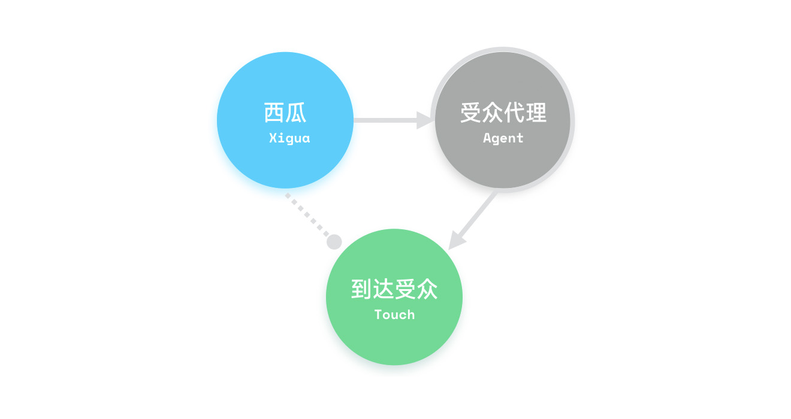

# 欢迎使用

> Melon Video Language `简称 MVL` 是一套高效的影像设计语言。

#### 一套专用的影像设计语言
MVL 是西瓜([xiguacity](http://xiguacity.cn))专属的影像设计语言。它旨在解决在西瓜的影像制作过程中出现的大量协调性问题。且作为一套详尽的指南，给予影像设计师贴心的指导。

#### 设计管理的一部分

> 设计管理是在界定设计问题，尽可能地使设计师在既定的预算内及时解决设计问题。

MVL 属于西瓜的品牌管理内容中重要的一部分。设计管理，除了定义品牌，更多的蕴含了设计在组织各个环节的深入参与和互动的机理。作为设计师，并作为影像设计师，必然要与运营，工程，管理等部门进行合作，共同完成设计目标。所以，我们在设计过程中需要明确的是：<em class="s">MVL 与我们进行的影像设计工作，都属于设计管理的范畴，设计师除了把握具体方案展现和创作，还必须参与到对目标的选择、过程、程序和资源分配的工作中，并善用 MVL，不断强化设计管理意识，使组织更加高效，使品牌更加有力。</em>

#### 我们遇到了哪些问题？
在长期的影像制作中，我们遇到过各种棘手的问题。比如素材质量不可控，观看体验不尽人意，剪辑时无法确定使用哪些有效的视觉手法，视听效果不统一……等等问题。我们常规的解决办法也有其问题，例如再遇到同类问题很难去追溯和整理。


#### 这套影像设计语言的目标是什么？
这套影像设计语言不仅仅是一个简单的影像设计规范，它需要达成的目标如下：
* 品牌传达是一致的，明确的，强化的
* 考虑可延续和可复用的设计
* 给予积极的暗示及心理的关照
* 课程内容通过符号进行暗示
* 元素设置多元且明智的

#### 持续迭代的影像设计系统
MVL 正在随时更新，并且 MVL 也将汇集团队在影像设计过程中产生的各种技巧与心得。详情请参考 [维护指南](./quickstart?id=维护指南)。

#### 不仅仅是文档，更是设计利器！
MVL 不仅仅是文档，还包含了各种设计工具集合，素材和详尽的操作指南。希望这套影像设计语言成为你日常设计工作中的得力助手，帮助你完成精美的影像设计与剪辑！

# 原则
> 设计原则是所有问题追溯的本源。

我们在进行影像设计时，必要明确我们的「到达受众」（学生）及最终目的，而关于目的及受众的阐释及分析，有可能涵盖了太多的知识点以及衍生信息，所以，将这些概念凝结为几个大的原则关键词，可以有效的辅助影像设计师记忆和追溯。

对原则的记忆及活用是必要的，这将有助于我们在设计中偏行时能始终找到正确的方向。在了解原则之前，我们先确定几个前提：

#### 我们最终解决了谁的问题？
这套影像设计语言最终并不只是为了解决我们自身的效率问题，它更解决了「到达受众」（学生）的问题…… 我们需要考虑服务的终端目标是谁。很明确，我们的产品服务最终到达于`8-12岁少儿`这个群体。我们产品目标价值是为了满足用户群的需求。用户群中不但包含了「到达受众」，同时也包含了「受众代理」。所以，产品的各功能都`对应了这两种用户的各种情感及物质层面的需求`。

#### 用户关系

我们的产品针对的用户群，并不单单只有「到达受众」（学生）这个群体，同时还有很重要的「受众代理」（学生家长），这里有一个重点：*西瓜的产品信息，并不完全或直接地传达到「到达受众」。其部分或间接地传达至「到达受众」，这个过程会受到「受众代理」的决策影响。*


<center>西瓜的产品用户基本关系（XAT）</center>

所以，在影像制作过程中，我们需要考量「受众代理」，也就是学生家长的观看感受，其可能直接影响到「受众代理」最开始接触产品时留下的印象，从而影响到他的决策。在原则设定中，我们强化了这个前提，并考虑了相关原则的适配。

> 在用户群（包含了「到达受众」和「受众代理」）使用产品后期阶段（接触并建立初期信任过后），西瓜产品的信息可更完整传递到「到达受众」。所以*前后信息传达差异也需要注意*。

#### 到达受众的心智确定
从产品及「到达受众」（学生）的需求中进行定性及确定前提。「到达受众」（学生）的心智成为了他们明确自身需求的来源。所以*了解最终用户的心智类型非常重要。*在这里，我们选择两个对核心影响最相关的结论：

* 在我们主要用户这个群体中，影像传达须明确我们的最终目的是——*充分展现产品「可被信任」的特性。*实质上，对少儿心理产生最大影响的要素，是其适应社会的过程。儿童对于社会权力不同线索的认知发展表现出与人类进化一致的进程(Hawley, 1999)。归根结底，洞察「到达受众」（学生）的`情感及物质层面的需求`是要满足于「帮助及增加其适应力」而存在的。从进化学的角度看,  儿童认知社会权力的线索大致从早期适应性线索(团体人数多少、个体身体大小、资源获得和目标达成等)往后来的相对近代适应性线索(表情与姿势线索、模仿与被模仿关系、下达命令、制定规则等)发展。从社会关系角度来看，随着年龄的增长，儿童更多的融合到社会复杂关系当中，我们的主要用户群`8-12岁少儿`恰好出于这个融合的主要时期，帮助其认知及了解「社会关系」是符合他们的最终需求的。而我们影像设计与此有何关系呢？如之前所说——我们必须从产品及「到达受众」（学生）的需求中进行定性及确定前提。所以归根结底，影像中所有演绎，都要达成辅助产品满足「到达受众」（学生）的`情感及物质层面的需求`目标。

* 主要用户群`8-12岁少儿`的视觉心理——Lowenfeld 与 Brittain 在《创造与心智成长》中提到儿童对的创作发展特征，从某种层面可以反映其对于世界的认知模式。其中与主要用户群相关的三个阶段——*样式化阶段（图春期）*主要表现为 X 光画法，将视觉上无法看到耳朵东西，依据自我观念添加上去；*新迭代表现*，主要表现为选择画纸最容易画的方向作画，将移动视线时看到的事物都描摹下来；*基线表现*，绘制地平线，道路；时空交错表现，将不同时间与区域空间混合到一起的表现形式；*重复表现*，绘制相似的花朵及相似的动物……*理智萌芽期（党群期）*，这个时候的儿童已经开始有群体概念，主要有造型特征表现，色彩特征及空间表现特征。*拟似写实阶段（推理年龄）*，在这个阶段开始具有绘制人物造型的能力，也开始表现空间特征和色彩特征。Eisner 和 Rhoda Kellogg 也有过相似研究，可以确定的是，<em class="s">我们在进行影像设计时，应考虑「匹配」其认知，并适当「超越」其认知。从而辅助「产品系统与主要用户群体建立信任关系」。</em>

下面就让我们一起来看看哪些原则支撑着我们影像设计的核心关键要素和理念：

## 品牌
> 产品仅仅是品牌的子范畴，是品牌包裹着的组织体，品牌很大程度上定义了产品，并大大增加了产品所产生的意义与价值。品牌是一个复杂精妙的体系所组成的，没有品牌的管理，将大大地削弱我们的竞争力!

产品可被复现，但品牌无法被复现，世界上不可能出现两家同样品牌的企业…… 可口可乐（品牌价值 600 亿美元）总裁蒂文•海耶(Steven  Heyer)说，即使把可口可乐在全球的工厂全部毁掉，它仍可在一夜之间东山再起。品牌无疑是组织最宝贵的财富，可以说，我们的所有工作，都是围绕品牌并为之服务的。

> 早期人们把批发商的名字印在茶包上或是把牧场主的名字“烙”（Brand）在成群的牛身上，寻找各种机会将制造人或经销人的声誉“广而告之”。 

一个产品，除了能够给予消费者一定的使用价值的满足之外，更重要的是可以给消费者带来情感上的满足。消费者在使用一个产品时，除了认可它的使用价值之外，还通过它完成一定的情感体验。 这整套的情感体验再在消费者内心复现时，它可能只是一个名字，甚至是一个符号，但对于这段情感体验的感受，会与这个名字或符号关联起来，并投射出一系列后续的情感反应。


## 一致

无论是使用 Final Cut Pro 还是 After Effects。最终都应寻找一种办法，以实现同样效果为目的。所以，在实现时，需要考虑因为工具不同带来的差异，快速解决图形偏差、样式偏差、颜色偏差等等问题。

一致性，并不是死板地要求元素完全一致，而是寻找某种共性，寻求辩证统一的办法。

#### 一致性有多重要？

前面说到，产品是品牌的子范畴，品牌很大程度上定义了产品。<em class="s">品牌的表述需要表里如一</em>，这样才能让用户产生——这个品牌是「稳定的」，以至于是「可被信任」的。

实现一致性，将有助于我们解决诸多复杂的问题：
* 复用时更轻松，一致性的元素，往往是模版化的元素。多次使用均无需再从零开始，大大降低了使用成本。
* 传达是一致的，用户更容易建立「品牌印象」。
* 影像风格是一致的，用户更容易再次唤起「品牌印象」。


## 友好
产品中需要时刻的体现对于「受众代理」与「到达受众」的友好，而这里的友好有两个方向——对于「受众代理」来说，友好代表产品的品牌可被认识，它的表达是稳固的，更重要的是它的表达是清晰，简洁的。能够持续地被「熟识」的。这里的友好，更多是一种可被亲近的专业感。

而对于「到达受众」，友好更多代表亲密感。影像的设计须活泼，阳光与积极的。但活泼并不代表多变。万变不离其中，影像视觉风格需要首先考量一致性，并同时考虑「受众代理」这个群体，在此前提下。适当的表现朝气，活力。

## 视听
适当地使用一些独特的剪辑手法和运镜手法，将有助于持续加强用户的专注力。使用丰富的音响效果，并注意不要使声音显得过于突兀。具体请参考[音乐与音效](elements?id=音乐与音效)

## 聚焦
在特定的素材中，配合脚本内容，使用聚焦元素进行叠加，让用户的注意力与内容相匹配。这类元素成为聚焦元素。

聚焦可以大大减少信息噪音，保证内容的高信噪比，从而加强课程内容的*最终到达率*。
## 符号

> 符号影射了全部叙事并成为叙事的核心。

我们将西瓜的内容影像看做是一种叙事，它同时也是在努力地建立一种对等交流的语境。任何促使在这个过程中产生的交流更加有效的方法，都没有符号来得彻底和简便。

使用符号来影射内容，一方面可以加强观看者对于内容的初步认知，也减低了对内容未知带来的畏惧感。人的所有交流环境中，符号恐怕是最简短有效的传达方式（虽然会存在误差）。但如果建立一套品牌语境中的符号体系，将大大增强品牌呼应并可增强用户对品牌的认知。

切换章节时，使用固定的符号表示当前进入的板块，符号的作用一方面加强了内容的丰富性，另外也加强了用户对于内容的记忆力并且最核心的，<em class="s">降低了内容建立者与观看者之间的交流障碍和成本。</em>

# 维护指南
#### 加入时间戳
当内容改变时，须在该内容的区块内加入修改信息。请按照以下格式来填写。

```
<p class="update">更新于：2017年11月20日 NameHere</p>
```

实现效果：
<p class="update">更新于：2017年11月20日 NameHere</p>

---
<p class="copyright">©2017 XiguaCity Inc.</p>
<p class="copyright">Melon Video Language (MVL) was Created by INVO</p>