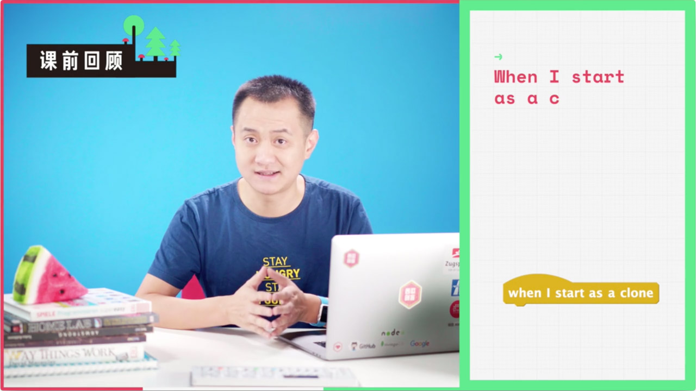
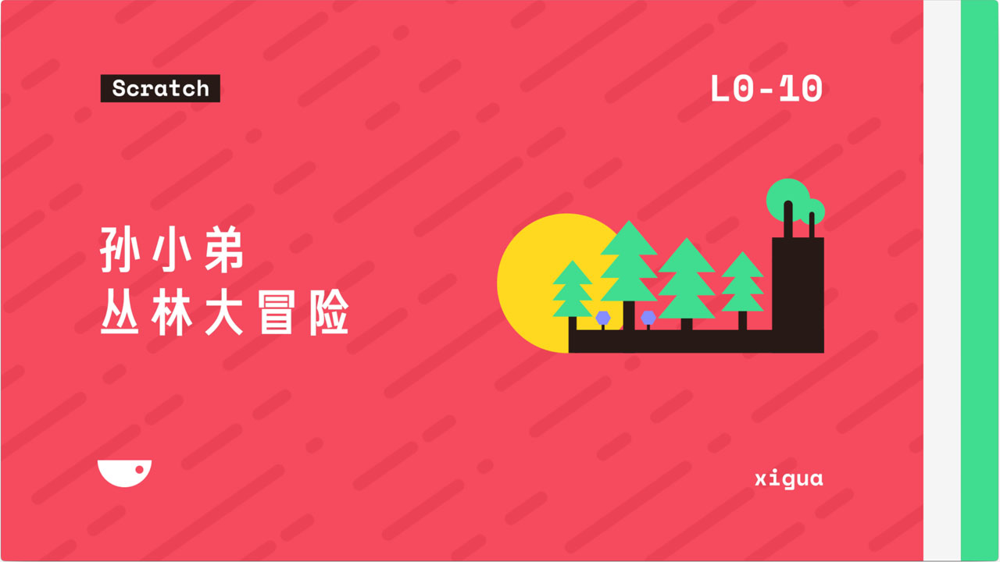
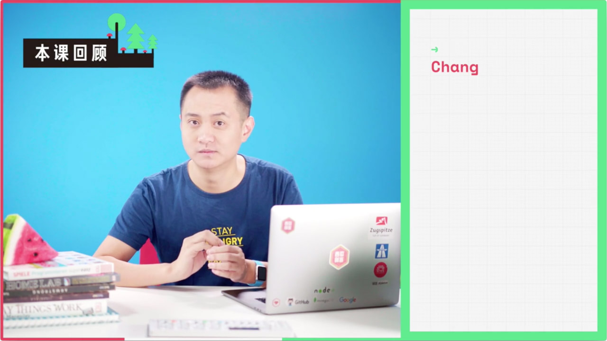
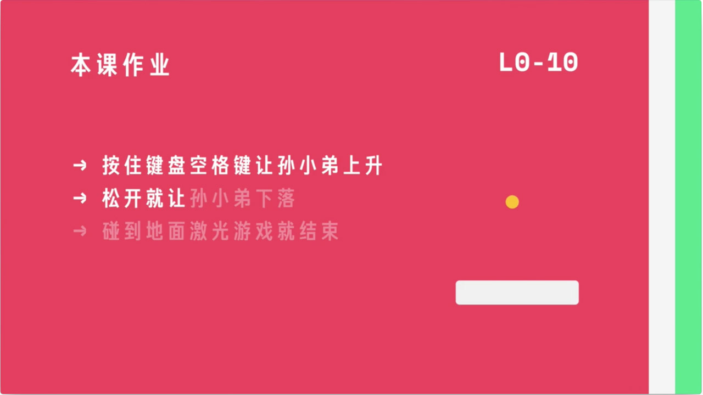

# 环节 Sections

MVL 影像中有多个环节设置。了解环节设置，有助于更清晰地指派分工和更高效地撰写脚本。

# 课前回顾 Recall

?> 使用目的：回顾上节课讲义，加深学生印象

课前回顾示意图

# 引入 Intro

?> 使用目的：增强品牌一致与连续感

引入示意图

# 正文 Context

?> 使用目的：利用生动的讲义强化老师的专业，增加西瓜的品牌感受。

 正文示意图

# 本课回顾 Recap

?> 使用目的：回顾当前课程重点内容，加深学生印象与记忆

本课回顾示意图

# 作业 Homework

?> 使用目的：布置当前课程相关的作业

作业示意图

---

©2017 XiguaCity Inc.

Melon Video Language (MVL) was Created by INVO
